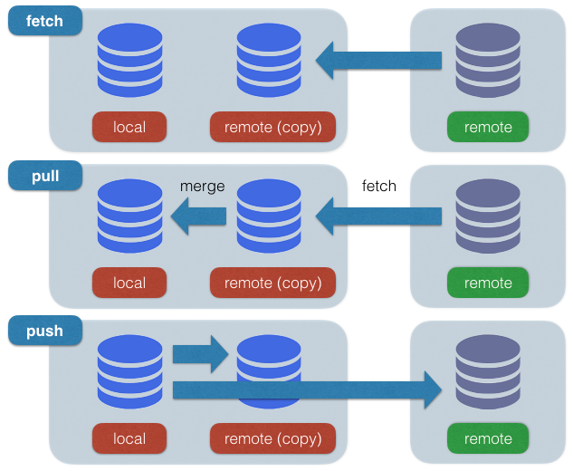

<!-- $theme: gaia -->

# チーム開発を変える<br>Gitの徹底活用法

#### 3/16 Pasona Tech セミナー

###### Sprocket CTO: 中田 稔

---

## Git とは？

---

==分散型バージョン管理システムの決定版！==

- テキストで管理できるものであればなんでも
  - Code、HTML、CSS、README、 etc.
- 差分情報を記録する
  - diff ベース
- 画像等のバイナリデータも扱える
  - あまり得意ではない
  - 差分が取れないため、まるっと保存

---

## diff とは？

---

2つのファイルを比較し、差分を抽出するツール

```diff
--- a/src/app.js
+++ b/src/app.js
@@ -19,7 +19,12 @@ const client = new Wit({

     getForecast: req => {
       console.log('getForecast:', JSON.stringify(req, null, '  '));
-      req.context.forecast = 'sunny';
+      if (!req.entities.location) {
+        req.context.missingLocation = true;
+      } else {
+        req.context.forecast = 'sunny';
+        req.context.location = req.entities.location[0].value;
+      }
       return Promise.resolve(req.context);
     }
   }
```

---

## バージョン管理の歴史1

- RCS
  - ファイル単体、ローカルでの差分管理
  - サーバ上の設定ファイルの履歴管理で今でも使ったりする

---

## バージョン管理の歴史2

- CVS
  - 中央管理サーバの登場
  - RCS を複数ファイルに対応したイメージ
    - ただし個別のファイルの集合体なので、それぞれのファイルにバージョンが付く

---

## バージョン管理の歴史3

- SVN
  - 複数ファイルの修正を纏めて履歴管理、バージョン番号をつけられるようになった
  - バージョン番号が連番で付与される

---

## バージョン管理の歴史4

- Git
  - 中央管理サーバの排除・分散化
    - 独立した複数のリポジトリが協調して作用
    - リモート、分散開発に有利
  - ローカルも1つの独立したリポジトリ
    - ネットがなくても使える！

---

## ローカルとリモート

分散管理なので、少々概念がややこしい


---

## チーム開発における<br>Git活用のポイント

---

## Git活用のポイント1

ブランチを多用する

- 何か作業をするときは基本的にブランチを作る
  - 違う機能やバグ修正は別ブランチ
  - ブランチ毎に==作業の独立性==を保つ
    - 他人の修正の影響を極力避ける
- 修正が終わったらプルリクエスト
  - マージされたらブランチ削除
  - ==作業場感覚==で作っては捨てる

---

## Git活用のポイント2

目的が明確なコミットを作る

- 1つの機能追加・バグ修正を==1つのコミット==にする
  - 中途半端・不完全なコミットを作らない
  - 「作業途中」「fix typo」 とかはダメ
  - レビューする人が苦痛
- 大きな機能追加の場合はサブ機能毎にコミットを作ることはある
  - 大量の修正をレビューするのは大変
  - コミット単位でレビューできるように

---

## Git活用のポイント3

コミットログだけで==修正内容がわかる==ようにする

- レビューしたり後から調査する際に重要
  - コードの中身を毎回見ていられない
  - 「バグ修正」「機能追加」のようなものはダメ
  - 「○○の□□を××した」のように明確にする
- ポイント2ができていれば自ずと明確になるはず

---

## Git活用のポイントまとめ

1. ブランチを多用する
2. 目的が明確なコミットを作る
3. コミットログだけで修正内容がわかるようにする

初めからそんなキレイなコミットは作れない...
⇒ 後から整理すればOK
⇒ ==履歴の書き換えが必須==

Gitは履歴を書き換えてなんぼの世界！

---

## 使い勝手を向上させる設定

---

## alias の作成

`git log` はそのままでは使いにくいので、graph 表示が可能なように alias を作成する

```bash
% git config --local alias.graph \
  "log --graph --oneline --decorate=short"
```

これで `git graph` が使えるようになる
※ 実際はもっと良い設定あり

```bash
% git graph

* fe78873 (HEAD -> master, origin/master) initial commit
```

※ 今回は `--local` ですが、`--global` が便利

---

他にも、SVN ユーザであれば

```bach
ci => commit
co => checkout
```

等の設定をしておくと便利。

`git ci`、`git co` のように利用できる。

---

## ブランチ操作をマスターする

---

## branch

ブランチの一覧、作成、削除等の操作を行う

```bash
% git branch --help
```

---
<!-- *template: invert -->

## branch 操作の実践

ブランチ一覧を見る（ローカルのみ）

```bash
% git branch

* master
```

ブランチ一覧を見る（リモート込み）

```bash
% git branch -a

* master
  remotes/origin/master
```

---
<!-- *template: invert -->

現在位置でブランチを作成する

```bash
% git branch test
% git branch

* master
  more_docs
  test

% git graph

* 8ee37c5 (HEAD -> master, origin/master, test) 使い勝手を向上させる設定を追加
* de78949 Git活用のポイントを追加
* bd1ba42 ローカルとリモートの図を追加
* bd7a8a9 バージョン管理の歴史を追加
* 8a57c36 git と diff のスライドを追加
* 336878d initial commit
```

---
<!-- *template: invert -->

ブランチをリネームする

```bash
% git branch -m test example
% git branch

  example
* master
  more_docs
```

ブランチを削除する

```bash
% git branch -d example

Deleted branch example (was 8ee37c5).

% git branch

* master
  more_docs
```

---

## checkout

ブランチを切り替えたり作業ツリーを復元する

```bash
% git checkout --help
```

---
<!-- *template: invert -->

## checkout の実践

作業ツリーを指定ブランチに切り替える

```bash
% git checkout more_docs

Switched to branch 'more_docs'
Your branch is up-to-date with 'origin/more_docs'.

% git branch

  master
* more_docs
  test
```

---
<!-- *template: invert -->

新しいブランチを作成して切り替える

```bash
% git checkout master -b test

Switched to a new branch 'test'

% git branch

  master
  more_docs
* test
```

ブランチ名(master) は省略可能、省略した場合は現在位置(HEAD)が使われる

---

## merge

別のブランチの内容を現在のブランチに取り込む

```bash
% git merge --help
```

---
<!-- *template: invert -->

## merge の実践

別のブランチの内容を現在のブランチに取り込む

```bash
% git checkout master
% git merge more_docs

Merge made by the 'recursive' strategy.
 another_doc.md | 3 +++
 1 file changed, 3 insertions(+)
 create mode 100644 another_doc.md
```

※ ブランチが分岐していない場合は FastForward になる

---
<!-- *template: invert -->

merge の確認

```bash
% git graph

*   fcc71ea (HEAD -> master) Merge branch 'more_docs'
|\
| * a973eb9 (origin/more_docs, more_docs) another_doc.md を追加
* | 4967a5c checkout を追加
* | 4116edf branch を追加
|/
* 8ee37c5 (origin/master) 使い勝手を向上させる設定を追加
* de78949 Git活用のポイントを追加
* bd1ba42 ローカルとリモートの図を追加
* bd7a8a9 バージョン管理の歴史を追加
* 8a57c36 git と diff のスライドを追加
* 336878d initial commit
```

---

## tag

tag の一覧、追加、削除等の操作

```bash
% git tag --help
```

コミットIDは覚えられないので、リリース等の重要なポイントでタグをつけておく

---
<!-- *template: invert -->

## tag の実践

現在のコミットに tag をつける

```bash
% git tag v1
% git graph

* 0d35716 (HEAD -> master, tag: v1) merge を追加
* 4967a5c checkout を追加
* 4116edf branch を追加
...
```

---
<!-- *template: invert -->

指定のコミットに tag をつける

```bash
% git tag v0 HEAD^
% git graph

* 0d35716 (HEAD -> master, tag: v1) merge を追加
* 4967a5c (tag: v0) checkout を追加
* 4116edf branch を追加
...
```

コミットIDを指定するとその場所にタグが付く

- `HEAD`: 現在の場所
- `HEAD~`: 1つ前の場所
- `HEAD~~`: 2つ前の場所（~を複数つけられる）
- `HEAD~3`: 3つ前の場所（~n でn個前を指定できる）

---
<!-- *template: invert -->

tag を削除する

```bash
% git tag -d v0 v1

Deleted tag 'v0' (was 4967a5c)
Deleted tag 'v1' (was 0d35716)

% git graph

* 0d35716 (HEAD -> master) merge を追加
* 4967a5c checkout を追加
* 4116edf branch を追加
...
```

---

## 作業を効率的に<br>行うための操作

---

## stash

未コミットの作業内容を一時的に保管・復元する

stash = 隠す、しまう

```bash
% git stash --help
```

ブランチAで作業中、ブランチBで別作業が必要になった（緊急対応等）
ブランチAでの作業が途中、コミットしたくない

⇒ stash で途中の状態を出し入れする

---
<!-- *template: invert -->

## stash の実践

master ブランチで README.md を編集・保存

```bash
% git status

On branch master
Your branch is up-to-date with 'origin/master'.
Changes not staged for commit:
  (use "git add <file>..." to update what will be committed)
  (use "git checkout -- <file>..." to discard changes in working directory)

        modified:   README.md

no changes added to commit (use "git add" and/or "git commit -a")
```

未コミットの差分がある状態

---
<!-- *template: invert -->

stash 実行

```bash
% git stash

Saved working directory and index state WIP on master: 19bbf33 tag を追加
HEAD is now at 19bbf33 tag を追加
```

status 確認

```bash
% git status

On branch master
Your branch is up-to-date with 'origin/master'.
nothing to commit, working tree clean
```

修正がなくなっている

---
<!-- *template: invert -->

stash 確認

```bash
% git stash list

stash@{0}: WIP on master: 19bbf33 tag を追加

% git stash show

 README.md | 2 +-
 1 file changed, 1 insertion(+), 1 deletion(-)
```

---
<!-- *template: invert -->

git show で中身も確認できる

```diff
% git show stash@{0}

...
    WIP on master: 19bbf33 tag を追加

diff --cc README.md
index c5d478f,c5d478f..fbee71b
--- a/README.md
+++ b/README.md
@@@ -1,6 -1,6 +1,6 @@@
  <!-- $theme: gaia -->

--# チーム開発を変える<br>Gitの徹底活用法
++# チーム開発を変える<br>Gitの徹底活用法！

  #### 3/16 Pasona Tech セミナー
```

---
<!-- *template: invert -->

stash の復元

```bash
% git stash pop

On branch master
Your branch is up-to-date with 'origin/master'.
Changes not staged for commit:
  (use "git add <file>..." to update what will be committed)
  (use "git checkout -- <file>..." to discard changes in working directory)

        modified:   README.md

no changes added to commit (use "git add" and/or "git commit -a")
Dropped refs/stash@{0} (c780a9ab1ed4b8da3fea1a8b572197b9fa5a2c77)
```

復元されていることを確認

※ `git checkout README.md` で修正を破棄しておく

---

## reset

現在位置を指定の状態にリセットする

```bash
git reset [モード] [コミットID]
```

モードは複数あるが、`--soft`、`--mixed`、`--hard` がよく使われる
モードを省略した場合は、`--mixed` になる

コミットIDを省略すると、`HEAD` になる

---
<!-- *template: invert -->

## reset --soft 実践

`--soft` は index 追加状態で巻き戻す

事前準備：状態確認

```bash
% git graph

* 82f7931 (HEAD -> master, origin/master) stash を追加
* 19bbf33 tag を追加
* 0d35716 merge を追加
```

---
<!-- *template: invert -->

`reset --soft` の実行

```bash
% git reset --soft HEAD~
% git graph --all

* 82f7931 (origin/master) stash を追加
* 19bbf33 (HEAD -> master) tag を追加
* 0d35716 merge を追加

% git status

On branch master
Your branch is behind 'origin/master' by 1 commit, and can be fast-forwarded.
  (use "git pull" to update your local branch)
Changes to be committed:
  (use "git reset HEAD <file>..." to unstage)

        modified:   README.md
```

README.md は add された状態

---
<!-- *template: invert -->

## reset --mixed 実践

`--mixed` は index 未追加状態（更新ファイルは存在）で巻き戻す

事前準備：pull して状態を最新に戻す

```bash
% git pull

Updating 19bbf33..82f7931
Fast-forward
 README.md | 132 ++++++++++++++++++++++++++++++++++++++++++++++++++++++++++++++++++++++++++++++++++++++++++++++++++++++++++++++++++++++++++++++++++++
 1 file changed, 132 insertions(+)

% git graph

* 82f7931 (HEAD -> master, origin/master) stash を追加
* 19bbf33 tag を追加
```

---
<!-- *template: invert -->

`reset --mixed` の実行

```bash
% git reset --mixed HEAD~
% git graph --all

* 82f7931 (origin/master) stash を追加
* 19bbf33 (HEAD -> master) tag を追加
* 0d35716 merge を追加
```

---
<!-- *template: invert -->

状態確認

```bash
% git status

On branch master
Your branch is behind 'origin/master' by 1 commit, and can be fast-forwarded.
  (use "git pull" to update your local branch)
Changes not staged for commit:
  (use "git add <file>..." to update what will be committed)
  (use "git checkout -- <file>..." to discard changes in working directory)

        modified:   README.md

no changes added to commit (use "git add" and/or "git commit -a")
```

README.md の修正は add されていない

---
<!-- *template: invert -->

## reset --hard 実践

`--hard` は完全破棄した状態で巻き戻す

事前準備：pull して状態を最新に戻す

```bash
% git checkout README.md
% git pull

Updating 19bbf33..82f7931
Fast-forward
 README.md | 132 ++++++++++++++++++++++++++++++++++++++++++++++++++++++++++++++++++++++++++++++++++++++++++++++++++++++++++++++++++++++++++++++++++++
 1 file changed, 132 insertions(+)

% git graph

* 82f7931 (HEAD -> master, origin/master) stash を追加
* 19bbf33 tag を追加
```

---
<!-- *template: invert -->

`reset --hard` の実行

```bash
% git reset --hard HEAD~
% git graph --all

* 82f7931 (origin/master) stash を追加
* 19bbf33 (HEAD -> master) tag を追加
* 0d35716 merge を追加

% git status

On branch master
Your branch is behind 'origin/master' by 1 commit, and can be fast-forwarded.
  (use "git pull" to update your local branch)
nothing to commit, working tree clean
```

ローカルの修正がないことを確認

※ `git pull` して最新にしておく

---

## reflog

困ったときの魔法の杖

git の作業履歴は逐一記録が取られている
⇒見えないコミットとして扱われている

```bash
git reflog
```

間違ってブランチを削除した、reset した等、「やっちまった」を==なかったコト==にする

実際に巻き戻す際は `reset --hard` を使う

---
<!-- *template: invert -->

## regflog 実践

master ブランチで README.md を編集・保存

```bash
% git add README.md
% git commit -m 'test commit'
% git graph

* 438871e (HEAD -> master) test commit
* a0888b6 (origin/master) reset を追加
* 82f7931 stash を追加
```

master が origin/master より1つ進んだ状態になる

---
<!-- *template: invert -->

`reset --hard` 実行

```bash
% git reset --hard HEAD~
% git graph

* a0888b6 (HEAD -> master, origin/master) reset を追加
* 82f7931 stash を追加
* 19bbf33 tag を追加
...
```

test commit が消えてしまったことを確認

---
<!-- *template: invert -->

reflog 実行

```bash
% git reflog

a0888b6 HEAD@{0}: reset: moving to HEAD~
438871e HEAD@{1}: commit: test commit
a0888b6 HEAD@{2}: commit: reset を追加
...
```

test commit が見えることを確認
他にもこれまでの操作が残っていることがわかる

---
<!-- *template: invert -->

reflog のコミットID で `reset --hard` 実行

```bash
% git reset --hard HEAD@{1}

HEAD is now at 438871e test commit

% git graph

* 438871e (HEAD -> master) test commit
* a0888b6 (origin/master) reset を追加
* 82f7931 stash を追加
```

消えたコミットが復活していることを確認

※ `git reset --hard HEAD~` で test commit を削除しておく

---

## チーム開発を円滑に<br>行うための操作

#### 意味のあるコミットを作成する

---

## add --patch

インデックスへの部分的な追加

```bash
% git add --patch
% git add -p
```

開発が乗っていると、対象の修正以上の作業をしてしまうことが多々ある

「コミットしたいが、したくない部分もある」に対応できる

hunk というコードの塊単位でコミット対象にするかしないかを選べる

---
<!-- *template: invert -->

## add --patch の実践

master で README.md を複数箇所編集・保存

```bash
% git add -p

diff --git a/README.md b/README.md
index 8069b01..6f004a3 100644
--- a/README.md
+++ b/README.md
@@ -1,6 +1,6 @@
 <!-- $theme: gaia -->

-# チーム開発を変える<br>Gitの徹底活用法
+# チーム開発を変える<br>Gitの徹底活用法！

 #### 3/16 Pasona Tech セミナー

Stage this hunk [y,n,q,a,d,/,j,J,g,e,?]?
```

---
<!-- *template: invert -->

入力待ちになるので、「?」を入れてみる

```text
y - stage this hunk
n - do not stage this hunk
q - quit; do not stage this hunk or any of the remaining ones
a - stage this hunk and all later hunks in the file
d - do not stage this hunk or any of the later hunks in the file
g - select a hunk to go to
/ - search for a hunk matching the given regex
j - leave this hunk undecided, see next undecided hunk
J - leave this hunk undecided, see next hunk
k - leave this hunk undecided, see previous undecided hunk
K - leave this hunk undecided, see previous hunk
s - split the current hunk into smaller hunks
e - manually edit the current hunk
? - print help
...
```

いろいろ操作できる！

---
<!-- *template: invert -->

## add --path を基本にする

commit すべきかどうかの確認も兼ねている

add するときは基本的に `-p` をつけることを意識した方が良い

※ 新規ファイルは出てこないので注意

---

## commit --amend

直前のコミットに対して修正を加える

```bash
% git commit --amend
```

追加漏れや typo など、直前のコミットをやり直したいことは多々ある

```bash
% git commit -m 'スペルミス修正'
% git commit -m 'ファイル追加漏れ'
```

こんなコミットは恥ずかしい
不要なものは極力作らない

---
<!-- *template: invert -->

## commit --amend の実践

master ブランチで README.md を編集・保存

```bash
% git add README.md
% git commit -m 'test commit'
% git graph

* 06a555f (HEAD -> master) test commit
* 041b910 (origin/master) reflog を追加
* a0888b6 reset を追加
```

test commit のコミットIDを覚えておく

---
<!-- *template: invert -->

typo が見つかった想定で、修正を加える

```bash
% git add README.md
% git commit --amend -C HEAD
% git graph

* 60b739e (HEAD -> master) test commit
* 041b910 (origin/master) reflog を追加
* a0888b6 reset を追加
```

test commit が書き換わっていることを確認

`git show` で見てもOK

※ `git reset --hard HEAD~` で test commit を削除しておく

---

## rebase (1)

ブランチの繋ぎ変えを行う

```bash
% git rebase [別ブランチ]
```

トピックブランチで開発していると、master 等の他のブランチとの乖離が進む場合がある

ブランチを繋ぎ変え、指定の位置につなぎ直すことで整理できる

---

## rebase (2)

インタラクティブに履歴の改変を行う

```bash
% git rebase -i ...
```

コミットを進めてから typo が見つかった場合は、amend では対応できない

`rebase -i` を使うことで、積み上げたコミットを並び替えたり、結合・分割したりできる

---

## GitHub を用いた<br>協調開発

---

## fork

GitHub 上のオープンソースのプロジェクトでは、メンテナでなければコミットできない

⇒ 自分が修正を行いたければ、リポジトリの複製を作る（fork）

fork したリポジトリは自分のものなので、好きなように改変する

---

## pull request

自分が行った修正内容の取り込み依頼

- fork してトピックブランチを作成
- 修正が完了したら fork 元に対して pull 依頼を出す
  - PR、プルリク

---

Git 活用のポイントを押さえていれば、非常に簡単

1. ブランチを多用する
2. 目的が明確なコミットを作る
3. コミットログだけで修正内容がわかるようにする

---

#### 是非 Git を活用して、
#### 効率の良い開発ライフを送りましょう！
